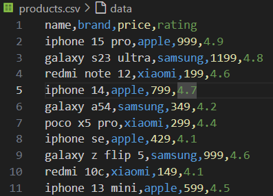
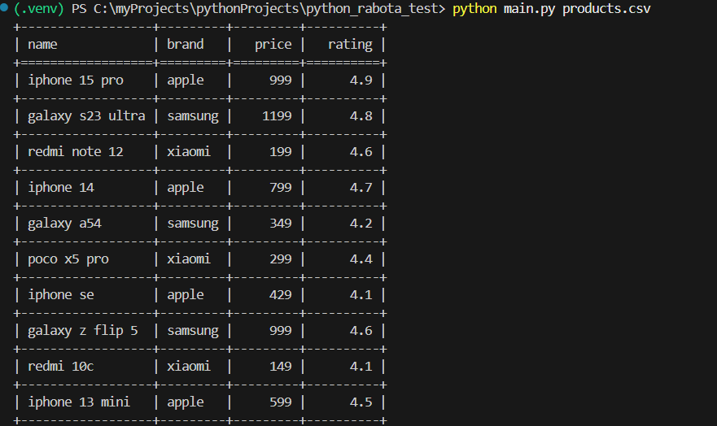
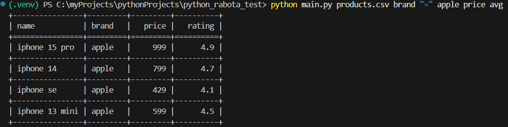
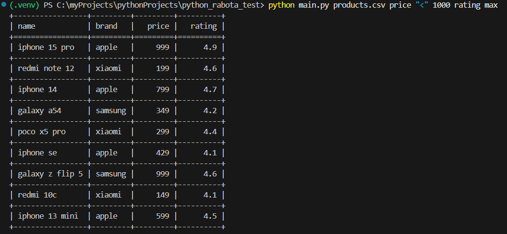

# Обработка csv файла
<h3>Не большой скрипь для вывода информации в виде таблицы</h3>

Данный скрипт способен выводить информацию, хронящуюся в CSV файле, при этом необходимо в терминале прописать одну из строк:

+ `python main.py products.csv`
+ `python main.py products.csv brand "=" apple price avg`
+ `python main.py products.csv price "<" 1000 rating max`

В данных строчках мы запускаем файл `main.py` и в него передаем некоторые параметры:

+ Во первых передаем файл, который будем обрабатывать, на пример `products.py`
+ Далее передаем параметры фильтрации данных, на пример просим показать товары дороже определенной суммы.

В данном виде исполнения запросов есть пара плюсов и минусов:

+ Плюсы
  1. Простота реализации, может сделать начинающий программист
  2. Подходит, если структура команды одинаковая
   
+ Минусы
  1. Точная привязка к порядку аргументов, если перепутать, все сломается
  2. Сложно добавлять дополнительныеопции
   
Но есть и более лучшая реализация данного скрипта, через именованные аргументы.

Снизу приведен пример команды в терминале

`python main.py products.csv --where "brand=apple" --aggregate "rating=min"`

Данный пример наиболее менее ломающийся и передает аргументы, через специальные слова, которые программа обработает корректно, и ей без разницы в каком порядке они переданы.

Но данная реализация намного сложнее, особенно для начинающих программистов, по этому данный скрипт написан с помощью первого варианта - позиционные аргументы.

***
**Скриншоты реализации данного скрипта**

Для вывода информации в более удобном, читабельном виде я использовал такую библиотеку, как [tabulate](https://pypi.org/project/tabulate/), которую можно установить через терминал с помощью команды:

+ `pip install tabulate`

или, если данный способ не сработает, то тогда:

+ `pip3 install tabulate`

На скриншоте ниже приведен пример CSV файла.

***

Так выводится файл без аргументов, полностью, все содержимое.

Теперь давайте добавим аргументы в виде бренда телефонов [apple](https://www.apple.com/).

Наш скриншот теперь будет выглядеть так:

Теперь выведем продукцию, у которой цена меньше 1000.

## В заключении можно добавить:

В дальнейшем необходимо более глубже изучить [именованные аргументы](https://habr.com/ru/articles/144416/), так как с ними можно создать скрипт для обработки данных более гибким и улучшаемым в будущем.